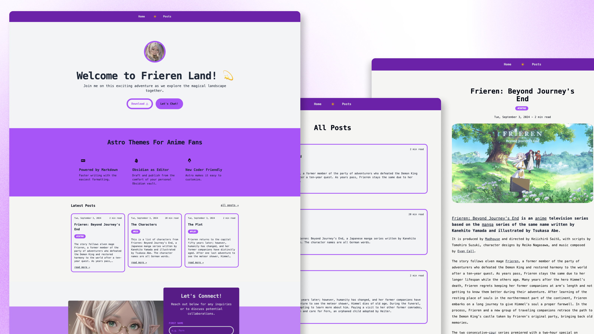

# Astro Frieren Blog Kit



## What is it about?

- It's an Astro blog theme based on the popular anime, [Frieren](https://en.wikipedia.org/wiki/Frieren).
- You can bingewatch the series on [Crunchyroll](https://www.crunchyroll.com/series/GG5H5XQX4/frieren-beyond-journeys-end).

## See it in action

[Demo site on Netlify](https://astro-frieren-blog-kit.netlify.app)

## Clone this repo

```
git clone https://github.com/fishingelephants/astro-frieren-blog-kit frieren-blog
```

```
cd frieren-blog
```

```
npm install
```

```
npm run dev
```

## Bonus tip:

### How to setup Obsidian to draft, edit, and publish blog post

- work in progress

## Folder Structure

Inside of your Astro project, you'll see the following folders and files:

```text
/
├── public/
├── src/****
│   └── pages/
│       └── index.astro
└── package.json
```

## Need Help?

You can contact via my biolink, [biolink.leifjerami.com](https://biolink.leifjerami.com).
You can have your own biolink [here](https://github.com/fishingelephants/astro-biolink-kit).
