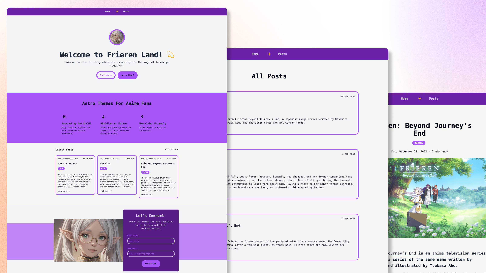

# Astro Frieren Blog Kit



## What is it about?

- It's an Astro blog theme based on the popular anime, [Frieren](https://en.wikipedia.org/wiki/Frieren).

### See it in action

[astro-frieren-blog-kit.netlify.app](https://astro-frieren-blog-kit.netlify.app)

## Clone this repo

```
git clone https://github.com/fishingelephants/astro-frieren-blog-kit frieren-blog
```

```
cd frieren-blog
```

```
npm install
```

```
npm run dev
```

## Folder Structure

Inside of your Astro project, you'll see the following folders and files:

```text
/
├── public/
├── src/****
│   └── pages/
│       └── index.astro
└── package.json
```
